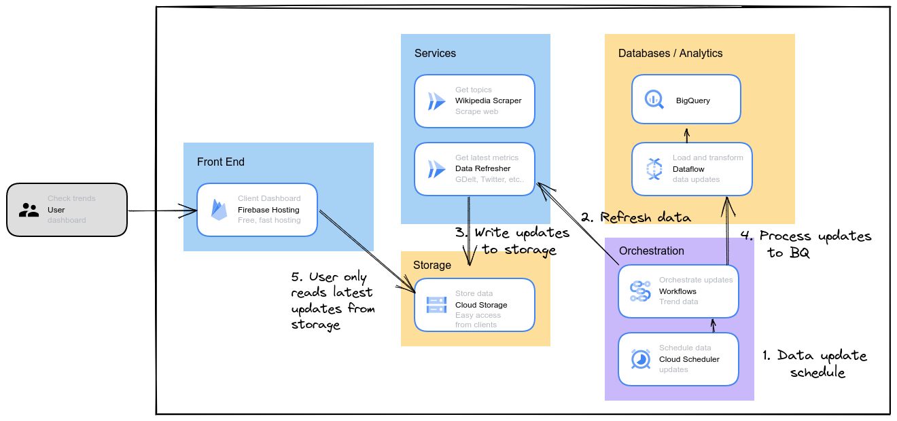

# Google Cloud Trendspotting Solution

This project provides a trendspotting solution to deploy and use in a Google Cloud environment. Trendspotting means monitoring data sources for a particular topic, and seeing updates for which entities in the topic are rising in popularity.

You can open a tutorial for the deployment by clicking on this button (opens the tutorial directly into Google Cloud Shell). 

Features in this deployment:
* Parse an initial set of terms to monitor trends for (for example herbal remedies, Harry Potter characters, or anything basically under the sun that you want to monitor...).
* Deploy monitoring pipelines to automatically check daily on how the terms are trending, data is aggregated into a BigQuery table.
* Deploy a monitoring dashboard app to view the trend status of the terms, and also display trend data from supported data sources (currently GDELT and Google Trends).

## LIVE demos 🎉

Here are two live dashboards generated by scraping Wikipedia for topic entities.

* [Sandwich Trend Tracker](https://sandwich-trends-thljhosrw.web.app)
* [Herbal Plant Trend Tracker](https://planttrends.web.app/)

## Trend data sources

The current version uses data from these trend data sources:

* GDELT global news stories
* Google Trends Search
* Google Trends YouTube
* Google Trends Shopping

GDELT is monitored by the **data_refersher** service and used to calculate if the number of articles has changed significantly and the topic is added to the trending section of the dashboard.

Data sources to be added in future versions:

* Twitter using the Twitter API (number of mentions, retweets, etc..)
* Reddit (mentions, upvotes)

## Architecture

This solution utilizes **Cloud Run**, **Dataflow**, **Cloud Workflows**, and **BigQuery** to check, monitor and process trend data.

It also utilizes **Firebase** and **Cloud Storage** for the web dashboard content.

